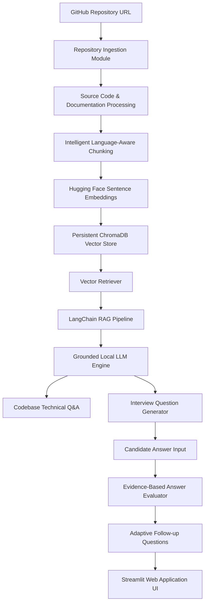

# RepoViva 🚀 | Generative AI Codebase Technical Interviewer

[](https://python.org)
[](https://streamlit.io)
[](https://langchain.com)
[](https://trychroma.com)
[](https://huggingface.co)
[](LICENSE)

**RepoViva** is an open-source, Retrieval-Augmented Generation (RAG) developer tool built with LangChain, ChromaDB, and local Hugging Face Sentence Transformers. It analyzes GitHub source code repositories and conducts **grounded, evidence-based technical interviews** based on actual codebases.

Unlike generic PDF/Chatbot implementations, RepoViva is strictly grounded in the target repository's code files—extracting exact line-number citations (`start_line`, `end_line`), evaluating candidate answers against real implementation logic, and generating adaptive follow-up questions.

---

## 🌟 Key Features

1. **🚀 Automatic Repository Ingestion**:
   - Clones any public GitHub repository via shallow clone (`git clone --depth 1`).
   - Recursively scans code files (`.py`, `.js`, `.tsx`, `.java`, `.cpp`, `.md`, `.json`, etc.) while pruning build artifacts (`node_modules`, `.git`, `__pycache__`, `.venv`).

2. **🧩 Intelligent Language-Aware Chunking**:
   - Uses syntax boundary splitting (`class`, `def`, `function`, `interface`, markdown headings) to keep code units intact.
   - Embeds rich metadata (relative file path, language tag, start line, and end line numbers).

3. **⚡ Local Hugging Face Embeddings & ChromaDB Vector Store**:
   - Converts code chunks into 384-dimensional dense vectors using `sentence-transformers/all-MiniLM-L6-v2`.
   - Stores vectors in a persistent local ChromaDB database with cosine similarity indexing.
   - **Zero Paid API Requirement**: 100% free and open-source execution.

4. **🔍 Grounded Codebase Q&A (RAG Pipeline)**:
   - Queries ChromaDB for top-$K$ matching code fragments.
   - Formulates grounded prompts that restrict answers strictly to retrieved code evidence.
   - Displays exact file paths and line number citations (`Lines 15-28`).

5. **🎓 Grounded Technical Interview Engine**:
   - Discovers key repository modules and generates open-ended technical questions categorized into *Architecture & Flow*, *Implementation Logic*, *Error Handling*, and *Dependencies*.
   - Pairs every question with target source files and expected technical concepts.

6. **📝 Evidence-Based Answer Evaluation**:
   - Evaluates candidate answers against ground-truth code snippets retrieved from ChromaDB.
   - Calculates candidate score (0–100), detects `strengths` vs. `missed_concepts`, and cites code line ranges.

7. **🔄 Adaptive Follow-up Question Generator**:
   - Dynamically formulates the next question: probing missed concepts for partial answers, or posing advanced optimization/scaling questions for high-scoring candidates.

8. **📊 Interactive Streamlit Web Dashboard**:
   - Glassmorphism dark-themed UI organized into 4 interactive tabs.
   - Session analytics summary with downloadable JSON evaluation reports.

---

## 🏗️ System Architecture



---

## 🛠️ Technology Stack

| Layer | Technology | Purpose & Rationale |
| :--- | :--- | :--- |
| **Language** | Python 3.9+ | Core application logic, script automation, and test runner. |
| **RAG Framework** | LangChain / LangChain-Community | Orchestrates prompt templates, document schemas, and retrievers. |
| **Embeddings** | Hugging Face (`sentence-transformers/all-MiniLM-L6-v2`) | Local CPU vector embeddings (384-dim), 100% free with 0 API costs. |
| **Vector DB** | ChromaDB | Persistent local vector store with HNSW cosine distance indexing. |
| **Frontend UI** | Streamlit (v1.50) | Responsive glassmorphism dashboard with interactive tabs & metrics. |
| **Version Control** | Git / GitHub | Code management, repository ingestion, and automated tracking. |

---

## 💻 Local Quickstart Guide

### 1. Clone the Repository
```bash
git clone https://github.com/Samanvay776/GenAI-Project.git
cd GenAI-Project
```

### 2. Create & Activate Virtual Environment
```bash
python3 -m venv .venv
source .venv/bin/activate
```

### 3. Install Production Dependencies
```bash
pip install -r requirements.txt
```

### 4. Run the Automated Unit Test Suite (33/33 Passing)
```bash
python3 -m unittest discover -s tests
```

### 5. Launch the Streamlit Web Application
```bash
streamlit run app.py
```
Open your browser at `http://localhost:8501`.

---

## 🌐 Public Cloud Deployment Guide

RepoViva is pre-configured for free one-click public cloud deployment on **Streamlit Community Cloud**.

### Deploying on Streamlit Community Cloud (Recommended)
1. Fork or push this repository to GitHub (`https://github.com/Samanvay776/GenAI-Project`).
2. Log into [share.streamlit.io](https://share.streamlit.io) using your GitHub account.
3. Click **New App** and select:
   - **Repository**: `Samanvay776/GenAI-Project`
   - **Branch**: `main`
   - **Main file path**: `app.py`
4. Click **Deploy**. Streamlit Cloud will build the app using `requirements.txt` and launch it under a public URL (e.g. `https://repoviva.streamlit.app`).

---

## 🧪 Testing & Verification Summary

| Module | Test File | Test Cases | Status |
| :--- | :--- | :--- | :--- |
| **Repository Ingestion** | `tests/test_ingestion.py` | URL validation, path skipping, scanning, mock git | ✅ PASS (7/7) |
| **Code Chunking** | `tests/test_parser.py` | Document schema, python/markdown chunking, line bounds | ✅ PASS (6/6) |
| **Vector Store** | `tests/test_vector_store.py` | Embeddings generation, ChromaDB add/count/query, scoring | ✅ PASS (5/5) |
| **LangChain RAG** | `tests/test_rag_pipeline.py` | Grounded context formatting, citations extraction, RAG execution | ✅ PASS (5/5) |
| **Question Generator** | `tests/test_interview_generator.py` | Codebase question generation, topic categorizing, concepts | ✅ PASS (4/4) |
| **Answer Evaluator** | `tests/test_evaluator.py` | Ground-truth grading, strengths/missed concepts, adaptive follow-ups | ✅ PASS (4/4) |
| **Web UI Integration** | `tests/test_app.py` | Entry point check, requirements validation | ✅ PASS (2/2) |

**Total Test Suite Result**: `33/33 Tests Passed (0.009s)`

---

## 📄 License

This project is licensed under the [MIT License](LICENSE).
