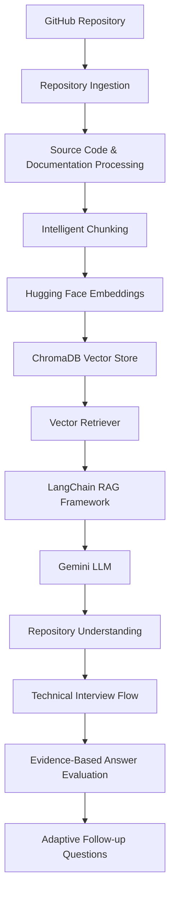

# RepoViva Architecture

RepoViva is a Generative AI developer tool that conducts technical interviews grounded in a specific GitHub repository's actual codebase. It avoids generic chatbot responses by leveraging Retrieval-Augmented Generation (RAG) mapping directly to the ingestion, parsing, chunking, embedding, retrieval, and evaluation steps.

## System Architecture Flow

The system flows sequentially from repository ingestion to adaptive follow-up questioning:

---

## Architectural Components

### 1. Repository Ingestion
* **Inputs**: GitHub Repository URL.
* **Process**: Clones or downloads the repository contents locally (e.g., using `git clone` or zip extraction) to prepare for processing. Ignores binary files, Git history files, lockfiles, and dependency files (e.g., `node_modules`, `.venv`, `.git`) to optimize system performance.

### 2. Source Code & Documentation Processing
* **Process**: Traverses the local file tree, categorizing files into source code (e.g., `.py`, `.js`, `.java`) and documentation (e.g., `.md`, `.txt`).
* **Metadata Extraction**: Extracts critical context per file: file path, filename, file size, extension, and structure details.

### 3. Intelligent Chunking
* **Strategy**: Standard text splitting can cut functions/classes in half, losing semantic meaning. RepoViva uses language-specific splitters (e.g., LangChain's `RecursiveCharacterTextSplitter.from_language` for Python, Markdown splitters for documentation).
* **Chunking parameters**: Standardizes chunk size (e.g., ~1000 characters) and overlap (e.g., ~150 characters) while maintaining module boundaries.
* **Rich Metadata Enrichment**: Embeds the absolute file path, relative file path, start line, and end line numbers into the metadata of each chunk.

### 4. Embeddings Generation
* **Model**: Sentence-Transformers embeddings (e.g., `all-MiniLM-L6-v2` or similar Hugging Face models) via LangChain.
* **Rationale**: Fast, offline execution, free, and optimized for code/text retrieval.

### 5. Vector Database (ChromaDB)
* **Storage**: Local persistence of vector databases via ChromaDB.
* **Process**: Chunks and embeddings are stored, indexed, and cataloged. Each project creates a unique ChromaDB collection to prevent overlap.

### 6. Retrieval Engine (Retriever)
* **Strategy**: Vector store retriever using similarity search. Can be enhanced with parent-document retrieval or filtering by metadata (e.g., file types or specific modules).
* **Output**: Top $K$ code segments relevant to a specific concept or query.

### 7. LangChain RAG Framework
* **Orchestration**: Manages the flow of user answers, retrieved documents, prompt templates, and Gemini API calls.
* **Prompt Engineering**: System templates force the LLM to restrict its context to the retrieved code segments, preventing hallucinations.

### 8. Gemini LLM (Google Generative AI)
* **Model**: Gemini (e.g., `gemini-1.5-flash` or `gemini-1.5-pro` via `ChatGoogleGenerativeAI`).
* **Role**: Serves as the intelligent engine driving the technical interview generation, user response analysis, and feedback synthesis.

### 9. Repository Understanding
* **Concept**: Constructs a high-level summary of the repository's architecture, patterns, dependencies, and flow.
* **Utility**: Used to formulate the initial interview topics.

### 10. Technical Interview Engine
* **Flow**: Rather than a standard chat window, the system acts as an interviewer. It poses a series of code-grounded questions to the user (e.g., *"How is data flow managed between the server and ChromaDB in this codebase?"*).

### 11. Evidence-Based Answer Evaluation
* **Evaluation Core**: The user's response is compared against the actual repository content. The system queries ChromaDB for relevant code files to serve as "ground truth evidence".
* **Evaluation Criteria**: 
  1. *Accuracy*: Does the user's answer reflect the actual code?
  2. *Completeness*: Did they miss key details that are present in the files?
  3. *Evidence Check*: The LLM must cite specific file paths and code snippets to validate its assessment.

### 12. Adaptive Follow-up Questions
* **Flow**: Based on the score of the previous answer, the interviewer either poses a deeper, clarifying question (to explore areas they missed) or advances to a new topic.
